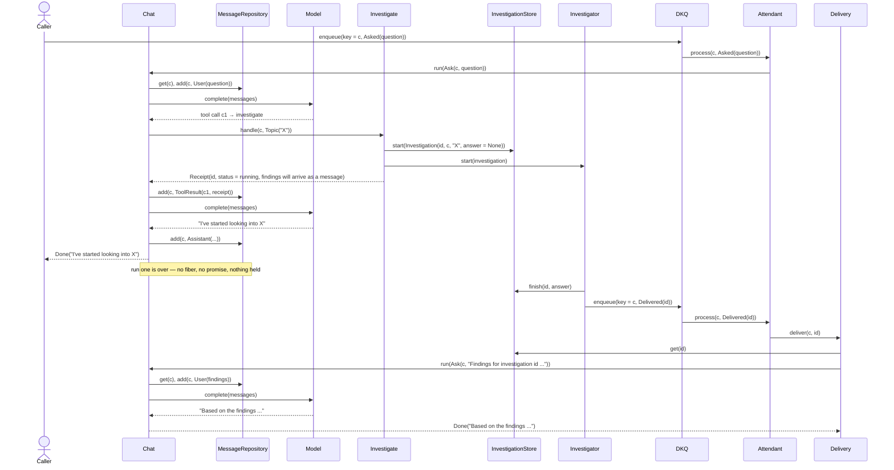

# A tool that answers later

[`Standing` was removed](tool-result-standing-removed.md) because it put in a domain type a fact that
belongs in storage, and [four shapes for putting it back](outstanding-work-in-storage.md) were written down
against the day it is wanted. This note is the third: the shape that needs nothing in the toolkit, built
out in `llm/v4/playground/outstanding` so the flow can be read rather than imagined.

The ports are unimplemented. What is real is the arrangement.

## The idea in one line

A tool that starts long work answers with a **receipt**, not a result; the run ends; and the findings come
back later as an ordinary message, put there by whoever a nudge wakes.

## The pieces

| tool | role |
|---|---|
| `Investigate` | the tool. Records the work, starts it, answers a receipt |
| `Investigation` | the row: id, conversation, topic, and an answer that is absent while it runs |
| `InvestigationStore` | where the tool keeps what it started — the whole of the bookkeeping the toolkit does not do |
| `Investigator` | what actually does the work, and what signals when it is done |
| `Delivery` | what a nudge wakes: reads the row, puts the findings back to the agent |
| `Incoming` | what arrives for a conversation — a question, or word that work has finished |
| `Attendant` | the single way in — a `Processor` over a `KeyedQueue[Conversation, Incoming]` |

They sit on top of `playground/chat`, unchanged apart from one thing: `Chat` takes a
`Registry[Conversation]` rather than a `Registry[Unit]`, so a tool can be told which conversation it is
being called in.

## The flow



## Run one, as the conversation grows

| after | the conversation holds |
|---|---|
| `open` | `User(question)` |
| the model asks for a tool | `+ Assistant([], calls = [c1])` |
| the tool answers | `+ ToolResult(c1, {"investigation":"a3f…","status":"running; …"})` |
| the model reads the receipt | `+ Assistant("I've started looking into X")` |

`Progress.from` drives every one of those transitions and knows nothing about any of this: an unanswered
call is `AwaitingTools`, an answered one is `AwaitingModel`, a turn with no calls and nothing after it is
`Finished`. The run ends the way any run ends.

## The gap

After run one, two things exist and neither mentions the other:

- the **repository** holds four messages, the last being the model's "I've started…"
- the **investigation store** holds one row, `(id, conversation, "X", answer = None)`

The conversation carries no record that anything is owed. That is the point. The row is the only record,
and it is the one a sweep would read — which is what makes the row able to say *what* is running and
whether it is still alive, where a promise in the transcript could only say that something once was.

## Everything arrives the same way

Per-key exclusivity only serialises what goes **through** the queue. A question put straight to `Chat`
while a delivery is being handled would run beside it on the same conversation, and the key would have
stopped nothing. So both go on the queue, keyed by the conversation, and the payload has to say which it
is:

```scala
enum Incoming:
  case Asked(question: String)
  case Delivered(investigation: Investigation.Id)
```

`Attendant` is then the only way in, and the only place that chooses between running the agent and delivering
findings. The conversation is not in the payload — it is the key the arrival is queued under:

```scala
def ask(conversation: Conversation, question: String): UIO[Unit]
def delivered(conversation: Conversation, investigation: Investigation.Id): UIO[Unit]
def process(arrival: (Conversation, Incoming)): IO[ApplicationError, Unit]
```

It is a `Processor`, so the loop that drives it is the toolkit's and it plugs into a graph like anything
else. Its intake is `Consumer.fromKeyedQueueWithKeys(queue)` — the key matters here, since the key *is*
the conversation.

Underneath, `KeyedQueue.takeWith` claims one value, runs the logic while holding its key, and frees the key
when that settles — per-key FIFO, one holder at a time. That is the shape the arrangement needs, and it is
why nothing here takes a lock.

`process` answers nothing. The agent's words went into the conversation as it worked, and whoever wants
them reads them there; nobody is waiting on the processor.

`KeyedQueue` holds its work in memory, so a process that dies loses what it had claimed. A distributed
keyed queue is the same shape with a lease on top, which is what makes a lost claim come back, and is what
a deployment would use.

## The wake

Three things happen outside this code, in this order:

1. `Investigator` finishes and calls `store.finish(id, answer)` — **the answer is recorded first**;
2. it calls `Attendant.delivered(conversation, id)`, queueing under **key = the conversation**;
3. the processor claims it and dispatches.

The ordering in (1) is why `Delivery.Unfinished` is a `TransientError` rather than a defect: a nudge that
arrives ahead of the write is ahead of a write already on its way, so the same nudge delivered again lands
after it. The key in (2) is why `Chat` does not apply `serialised` — per-key exclusivity does it, in the
infrastructure.

The payload is the id and nothing else, so a nudge that arrives twice reads the same row and delivers the
same findings.

`Delivery` takes the conversation from the key **and** from the row, and refuses when they disagree
(`Misrouted`, an `InconsistentState`). The key is what gave this run the conversation exclusively, so a row
naming a different one would be written into a conversation nothing is holding.

## Run two

`Delivery` reads the row, refuses if there is no such work (`Unknown`, a `NotFoundError`), if the key and
the row disagree (`Misrouted`), or if there is no answer yet (`Unfinished`), and then calls the agent:

```scala
chat.run(Chat.Ask(conversation, findings(investigation, answer)))
```

The row is what says **which conversation** — the model never wrote that and could not have, because the
conversation is the caller context and a schema never describes it.

From there it is an ordinary run: the findings go in as a `User` message, `Progress.from` says
`AwaitingModel`, and the model answers having read the whole conversation.

## The two things to take from it

**The delivery is input, not a result.** It is not a tool result — `c1` was answered long ago, when the
tool returned its receipt. It arrives as a user message because that is what it is: something new to read
and act on. This is exactly where `Standing.Delivered` lost its site, and why it went.

**Nothing reconciles.** Run two does not look for outstanding work, check a promise, or diff two records.
It appends and reads the conversation like every other run. The only thing that knows work was outstanding
is the row, and the only thing that reads the row is the nudge that named it.

## What the build surfaced

`Tool.handle(context, input)` **does not receive the call id.** The removal note said the tool "writes a row
keyed by the call id"; it cannot — only `Registered.invoke` knows it. So `Investigate` mints an
`Investigation.Id` of its own and returns it in the receipt, and the nudge carries that.

That works, and has something to recommend it: the id is in the text, so the model can quote it back and a
reader of the conversation can pair a delivery with the call that asked. But if the call id is wanted as
the key, `handle` has to be given it, and that is a change to the port rather than to an adapter.

## What is not here

The `Investigator` that does the work and signals when it is done, and — behind `Attendant` — the durable
queue a deployment would put there instead of an in-memory one. Both are the other side of a port; the
example stops where the toolkit stops.
