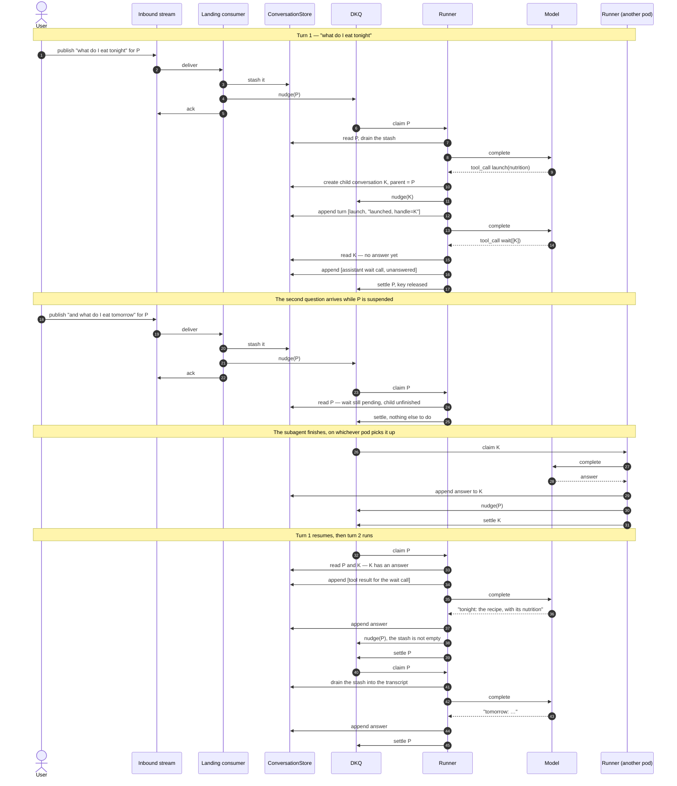

# The conversation model

> **Exploratory. Nothing here is a decision.** This is one session's thinking written down while it was
> still moving: positions taken to see where they lead, several of them already reversed further down the
> page, and none of them built. Where the text reads as settled — "the port is", "the runner does" — that is
> the voice of working an idea out, not a commitment anything is expected to honour. Nothing in this note has
> been implemented, reviewed against a running system, or promoted to [`../architecture/`](../architecture/).
> Treat every shape in it as a candidate.

Continues [`llm-design-exploration.md`](./llm-design-exploration.md), which left the transcript as a
hand-wave — `state.asRequest`, `Conversation.from(request)` — while settling everything around it. That gap
turned out to be upstream of the rest: the model port's signature and the loop's state both need to know what
a conversation *is*, and neither argument can be had concretely until it does.

It covers what a message might be, where the transcript could live, what the toolkit would refuse to model,
how a loop assembles around all three, and how a suspended turn gets woken — along with what was tried and
dropped on the way, which is the more useful half.

## 1. The toolkit owns the transcript; it does not own the agent's state

§4 of the earlier note argued that bounds and spend belong in the agent's own state rather than in
combinators, because `persisted` checkpoints `S` and a combinator's per-run `Ref` does not survive a resume.
That argument stands, and it is easy to misread as "the toolkit should stay out of the conversation
entirely".

The split that keeps both: the toolkit owns the *transcript* — what a message is, how a turn is appended,
how it renders to a request — and the application owns the *policy* — how many hops are too many, what to do
when the budget runs out, whether to summarise or answer partially. Spend and hop count are then facts the
transcript can report rather than rules it enforces.

## 2. Flat and one-to-one with the wire

A message is what the wire says a message is:

```scala
enum Message:
  case System(text: String)
  case User(text: String)
  case Assistant(content: Option[String], calls: Chunk[Tool.Call])
  case ToolResult(callId: String, content: String)
```

Familiar, trivially rendered, and one less translation between what we hold and what we send. The content
field is refined in §4; what is being decided here is flatness, not what a message may carry.

**The structural alternative, and why it lost.** The protocol's one hard rule is that an assistant turn
carrying `tool_calls` must be followed by exactly one `tool` message per `tool_call_id` before the next
assistant turn. A flat list can break it: three calls and one result, a result naming a call that was never
issued, two assistant turns back to back. A shape that pairs each call with its outcome —
`Turn.Calls(content, steps: NonEmptyChunk[Turn.Step])`, where a `Step` is a call *and* its outcome — cannot,
and `Session.dispatchAll` already promises one outcome per call in order, so the pairing is free at the point
it is currently implicit. It is the same move as `Pipe.KeySafe` and the unaskable tool namespace: make it
impossible rather than checked.

It lost on a principle worth stating plainly, because it applies well beyond this note:

> **Build over simple primitives rather than reaching for an interface that hands everything over
> out of the box. Glue is cheap when the pieces are well chosen.**

A shape nobody arriving from another library recognises has to be learned, documented and translated at both
ends, and it buys one invariant that a single well-placed append can also hold. The flat list can grow
structure later — as a constructor API, or as a view derived over it — and that is a cheaper bet than
starting with the clever shape and discovering what it forbids.

## 3. The transcript lives behind a store port

The first draft of §1 put the transcript in the workflow's `S` as a value with methods — `advance`, `render`,
`spend` — plus a private constructor and a "trusted rebuild" for reading it back out of the store. The
persistence half of that was ceremony over a problem the toolkit had already solved generically: a value in
`S` is checkpointed by `persisted`, its codec derived from its `Schema`, and nothing needs rebuilding.
Inventing a constructor protocol for it only picked a fight with the derivation.

The shape that replaced it is a port:

```scala
trait ConversationStore:
  def create(owner: Requester, id: ConversationId, opening: Chunk[Message]): IO[ApplicationError, Unit]
  def append(owner: Requester, id: ConversationId, turn: Chunk[Message]): IO[ApplicationError, Unit]
  def read(owner: Requester, id: ConversationId): IO[ApplicationError, Chunk[Message]]
```

§7 adds `stash` and `drain`, for input that has arrived but cannot legally join the transcript yet — for
reasons that only become visible once a turn can suspend.

Three properties are load-bearing:

- **Append is atomic, which is what earns this its own port.** `KeyValueStore[ConversationId, Chunk[Message]]`
  would otherwise cover it, but appending through a KV store is read-modify-write, and two concurrent appends
  lose one silently. That is the same failure `Stateful.Parallel` refuses by demanding a `Pipe.KeySafe`.
- **A turn is appended, not a message.** An assistant message carrying `tool_calls` and its results land
  together or not at all. One message at a time lets a reader catch the transcript mid-turn — a torn read of
  exactly the invariant §2 chose not to make structural — and the reader that sees it is the UI. Appending a
  turn also gives the pairing logic a single call site, which is what the rejected `advance` was for.
- **The owner is in the signature.** §6 of the earlier note argued for pushing the namespace into the data
  ports: `find(namespace, criteria)` cannot be queried across tenants even by a buggy tool. A store keyed on
  id alone is one bug away from a cross-user read, and this is a port a tool could plausibly be handed.
  Whether the owner rides as a parameter or as an unguessably minted id is open; *neither* is not an option.
  The id stays caller-supplied rather than minted: `owner` is already the real control, unguessability is
  defence in depth, and a supplied id lets a product key conversations off something it already has.
- **A conversation is created with what opens it.** `create` takes the messages, so the store never holds a
  conversation with nothing in it — a row that cannot be rendered into a request and that every reader would
  have to handle. Creation is then atomic in the same way an appended turn is: there is no window in which a
  reader sees a conversation being born.

Taking the opening as `Chunk[Message]` rather than as instructions-plus-a-first-message is §2 applied again:
**the system prompt is a message, in the sequence, like the wire says.** What that gives up is worth naming.
"Exactly one system message, and first" stays unenforced, in the same class as the alternation invariant §2
already left merely true. And because the port only creates, appends and reads, the system prompt is fixed
for the life of the conversation.

That last point meets a requirement from §1 — memory tiering is the application's to implement, but it can
only implement it if it can replace a prefix of the transcript with a summary. Two unrelated pressures now
want the same missing operation, which is usually the sign it belongs in the port rather than in a later
patch. What it should not be is a general `write`, which would give back every invariant `append` protects.

What this dissolves is most of §1's value type. The loop's state becomes an id and its counters rather than
the whole transcript, so every checkpoint is small; rendering `Chunk[Message]` into a request is an adapter
function; spend is a query over the transcript. `Conversation` survives only as a companion holding an id,
which by the conventions is better written as a plain opaque `ConversationId`.

## 4. Model what the loop reads; pass the rest through

§2 left a message's content as a string. That restricts every product built on the toolkit to text, and it
makes the toolkit the reason a product cannot use a provider feature — which a library has no business being.

```scala
enum Content:
  case Text(text: String)
  case Raw(json: Json)
```

`Text` is modelled because the loop reads it: the agent's control flow branches on what the model said.
`Raw` is forwarded verbatim, so an image, a PDF, a cache-control marker or whatever a provider ships next
quarter can go into a prompt without the toolkit modelling it and without waiting for a release here. This is
the §2 decision applied once more rather than a new one — messages are one-to-one with the wire, so a field
we have not modelled is carried as the wire wrote it.

```scala
enum Message:
  case System(content: Chunk[Content])
  case User(content: Chunk[Content])
  case Assistant(content: Chunk[Content], calls: Chunk[Tool.Call])
  case ToolResult(callId: String, content: Chunk[Content])
```

An empty `content` is "no text", so the `Option` §2 carried on the assistant turn goes away. `Chunk[Content]`
is heavier than a string for the common case, and the answer is constructors — `Message.user("…")` — which is
the glue the principle in §2 says to pay for.

The general rule:

> **Model what the loop must reason about — text, tool calls, finish reason, usage. Pass everything else
> through verbatim.**

It settles fields we had not reached yet. `CompletionRequest` carries an `extra: Json` merged into the body,
so temperature, reasoning configuration, provider routing and prompt-caching hints need no release here. The
line is principled rather than a matter of taste: if the agent's control flow does not branch on it, the
toolkit does not model it.

An escape hatch in every type is also how a library becomes `Json` with extra steps, so two things are fixed
now rather than discovered later:

- **Collisions refuse.** Where `extra` sets a key the toolkit also models, the modelled field wins and the
  collision is a typed failure. A silent overwrite would make the typed fields advisory, which is worse than
  not having them.
- **Replay must round-trip it.** The recorded adapter (§7 of the earlier note) has to carry `Raw` and `extra`
  faithfully, or fixtures stop matching live behaviour at precisely the features products reached for.

## 5. What it costs

Moving the transcript out of `S` sharpens §5.1 of the earlier note — at-least-once execution around the
checkpoint — rather than solving it. The transcript is now mutated *outside* the checkpoint, so a crash
between appending a turn and checkpointing the state replays the append and duplicates messages, where a
value in `S` would simply have been rewritten wholesale.

The answer is that appends are idempotent, which means a turn carries something to deduplicate on. The tool
half already has one — `call_id` — so the question is what identifies an assistant turn that made no calls.

`create` is where this bites first, and most visibly. Creating an id that already exists must refuse with a
`ConflictError` rather than overwrite someone's transcript — and a replayed `create` then hits its own
conflict, so the loop has to read "already exists, same owner" as success. Every operation on this port needs
that reading, not just the interesting ones.

None of this is free, and it is the bill for the UI being able to read the transcript while the agent is
still running.

## 6. How the loop assembles

§3 of the earlier note sketched the agent as a `Workflow` and left the type parameters loose. Against the
real signature they are not loose at all: `persisted` checkpoints under `I` and `serialised` locks on `I`, so
`I` is not "the request" in any general sense — it is the identity that decides what is serialised against
what, and what a checkpoint belongs to.

```scala
Workflow[R, E, ConversationId, AgentState, Answer]
```

**The input is the conversation, not the prompt.** Were the user's text part of `I`, each prompt in one
conversation would take a different lock key and a different checkpoint slot, and concurrent runs would
trample a single transcript — the thing `serialised` exists to prevent. The prompt therefore reaches the
conversation through the store, by `create` or `append`, and only then does a run start against the id. The
workflow never carries the prompt; it advances a conversation that already contains it.

That also answers §9.4 of the earlier note, which asked whether conversation identity wanted `Stateful`'s
per-key serialisation or `serialised(lock)`. It wants the lock, on the conversation id, and needs no entity.

**A run is a turn, not a conversation.** `Done` is the final answer and `persisted` deletes the slot there,
so one run spans one prompt to one answer; a multi-turn conversation is many runs against one id. The naming
invites the opposite reading, which is reason enough to write it down.

### The transcript is already a checkpoint

The transcript lives in the store and every turn is appended to it before any state would be written. A
resumed run can therefore reconstruct its position by reading it: an assistant turn whose `tool_calls` have
no results means dispatch is pending; a trailing set of tool results means the model is owed a call. Nothing
about that needs a second durable copy.

So `S` need not be durable. `Step.Init(id)` — effectful, which is what makes this natural — reads the
transcript and seeds the state; `Continue` carries the messages, the hop count and the spend for the run's
lifetime, in memory, because nothing serialises them. Durability is the store, and resumption is starting a
fresh run against the same id.

The counters survive that because they are derivable: hops are assistant turns, spend is the usage those
turns carry. Which makes it a dependency on §8.3 rather than a free win — if usage does not land on the turn,
it cannot be recovered from the transcript and the argument for dropping the checkpoint weakens with it.

`intercept` is untouched by any of this and still does what §4 of the earlier note asked — a cap no behaviour
can forget, reading the counters off `S` and replacing a `Continue` with a `Done`.

### The loop, roughly

Written out, the whole agent is one `Workflow` with two transitions and three helpers. It assumes §8.3 has
landed — a `Model` port, a response carrying content, calls, a finish reason and usage — and it omits the
scaladoc the conventions require of real code.

```scala
final case class ConversationRef(owner: Requester, id: ConversationId)

final case class AgentState(
  ref: ConversationRef,
  messages: Chunk[Message],
  hops: Int,
  spend: Cost,
)

final class AgentLoop(model: Model, tools: Tool.Registry[Requester], store: ConversationStore)
    extends Workflow[Any, ApplicationError, ConversationRef, AgentState, Answer]:

  override val name: String = "agent"

  def next: Step.Pending[ConversationRef, AgentState] => IO[ApplicationError, Step[ConversationRef, AgentState, Answer]] =
    case Step.Init(ref)       => seed(ref)
    case Step.Continue(state) => advance(state)

  private def seed(ref: ConversationRef): IO[ApplicationError, Step.Continue[AgentState]] =
    store.read(ref.owner, ref.id).map(messages => Step.Continue(AgentState(ref, messages, 0, Cost.zero)))

  private def advance(state: AgentState): IO[ApplicationError, Step[ConversationRef, AgentState, Answer]] =
    for
      session  <- tools.forSession(state.ref.owner)
      response <- model.complete(CompletionRequest(state.messages, session.advertised))
      step     <- response.finish match
                    case FinishReason.Stop      => answered(state, response)
                    case FinishReason.ToolCalls => worked(state, response, session)
                    case other                  => ZIO.fail(Halted(state.ref.id, other))
    yield step

  private def answered(state: AgentState, response: CompletionResponse): IO[ApplicationError, Step.Done[Answer]] =
    val turn = Chunk(Message.Assistant(response.content, Chunk.empty))
    store
      .append(state.ref.owner, state.ref.id, turn)
      .as(Step.Done(Answer(response.content, state.spend + response.usage.cost, state.hops + 1)))

  private def worked(
    state: AgentState,
    response: CompletionResponse,
    session: Tool.Session[Requester],
  ): IO[ApplicationError, Step.Continue[AgentState]] =
    for
      outcomes <- session.dispatchAll(response.calls.toList)
      turn      = Message.Assistant(response.content, response.calls) +: Chunk.fromIterable(outcomes).map(resultOf)
      _        <- store.append(state.ref.owner, state.ref.id, turn)
    yield Step.Continue(
      state.copy(
        messages = state.messages ++ turn,
        hops     = state.hops + 1,
        spend    = state.spend + response.usage.cost,
      )
    )

  private def resultOf(outcome: Tool.Outcome): Message =
    Message.ToolResult(outcome.callId, Chunk(Content.Text(outcome.content)))
```

Assembled, and capped by an interceptor that no behaviour can forget:

```scala
val agent = AgentLoop(model, tools, store).intercept(withinBudget).serialised(lock)
agent.run(ConversationRef(owner, id))
```

Four things in it are load-bearing rather than incidental:

- **The owner is part of `I`.** Every store call needs it and `Step.Continue` does not carry the input, so a
  bare `ConversationId` would leave the state unable to write to its own transcript. `ConversationRef` is
  what the lock and the checkpoint are keyed on, which is right: two owners cannot name the same run.
- **The session is derived per step, not held in the state.** It is a filter over the registry, so rebuilding
  it costs nothing, and it keeps `AgentState` a plain data value — which is what leaves the door open to
  checkpointing after all (§8.2).
- **A finish reason that is neither `Stop` nor `ToolCalls` fails the run.** `Length` and a content filter are
  not outcomes the model can be asked to reconsider, and the match is total, so nothing throws. Whether they
  deserve a partial answer instead of a failure is a policy question, and policy belongs to the application.
- **The transcript is appended after the model has answered.** A crash in between loses a response that was
  paid for and nothing else; a crash after `append` but before the next step replays a turn that is already
  written, which is exactly the duplicate §5 describes.

§7 amends this sketch in two places, and it is left as written so the reason is visible. `advance` gains a
third outcome — a turn that suspends rather than answering or continuing — and the `serialised(lock)` in the
assembly line goes, because per-key exclusivity moves to the queue that also wakes the run.

### What does not fit

**Nothing restarts a crashed turn.** `persisted` offered "re-run the same input and it resumes from the last
good state". Without it the transcript still holds the truth, but something has to notice that a conversation
is mid-turn and run it again — an inbound request, a sweeper, a `Processor`. This is the one real argument
for keeping the checkpoint despite it storing derivable data. §7 answers it: a lapsed queue lease returns
the work, which is the restart this lacked.

**Tool side effects stay at-least-once.** The window narrows to between running a tool and appending its
result, which is better than a step that also re-calls the model, but it is the same bill §5 describes. What
has changed is only that the boundary is now visible enough to decide about.

## 7. Subagents, and waking a suspended turn

A tool launches a subagent and returns at once — "launched", with a handle — so the parent can keep
reasoning. A second tool waits on those handles. The question that looks hard is how the subagent's result
gets back into the parent's conversation.

### Do not inject the result; reference it

The parent's transcript already holds the durable link. The launch call's result said `launched, handle=…`,
and that text is in the conversation for good. Nothing has to push a result *into* a conversation that may
not be running when the result appears; `wait(handles)` resolves the handle when the model asks for it, and
the answer arrives as that call's ordinary `ToolResult`. The launch call keeps the result it already got.

What makes that more than a trick is that **a subagent is a conversation**:

- `launch(task)` creates one under the same owner, records the parent it belongs to, and returns its
  `ConversationId` as the handle
- `wait(handles)` reads those conversations and resolves the ones that have an answer

Nothing new stores a subagent result, the UI gets the tree for free — children are conversations in the same
store, linked by a handle that appears in the parent's transcript — and `wait` is idempotent: re-running it
re-reads a finished child. §5's at-least-once problem does not bite this tool at all.

### The wake is a nudge, not a delivery

An in-process expectation is not a signal that survives anything. `Mailbox` resolves a receipt held in a
table in one process, so a pod crash or a rotation loses every expectation it held, and what is left is
polling.

The fix is not a more durable mailbox. It is that **the message that wakes a parent carries nothing**. It
says "look at this conversation again"; the result is already in the child's transcript. Every failure mode
of the signal then collapses into a re-read:

- a **duplicate** wake costs one read of the store
- an **early** wake — the child finishes before the parent has suspended — runs a turn that finds the `wait`
  pending, re-reads the children, and resolves
- a **lost pod** loses nothing, because the wake was durable before any pod saw it

Which is what makes at-least-once delivery sufficient, and therefore makes a durable queue the whole
mechanism. [`distributed-keyed-queue`](../../../distributed-keyed-queue) is that queue, keyed by conversation
id, and its README's worked example is this system: per-key exclusivity across instances, per-key order,
at-least-once with an attempt count, and *"nothing is lost when a consumer dies — the lease lapses, a
watchdog revokes the claim, and the work returns"*. `Dequeue` long-polls against wake streams, so no part of
this polls.

**Order the two writes rather than transacting them.** A child's runner enqueues the parent *before* settling
its own message. A crash in between redelivers the child's message, which enqueues the parent again — a
duplicate, which the previous paragraph already made free. At-least-once wake, no outbox, no shared
transaction between the transcript store and the queue.

This holds for user input too, and it is why the queue never carries any payload at all. A question arrives
on a stream, a consumer writes its text to the store, and the queue is told only that the conversation is
worth looking at. Where in the store it is written, and why the landing is safe, is the next section.

### What the client already offers

Written since this section was: dkq's client ships the signal as an API, so none of the above needs
building.

```scala
signals  <- Provider(client).signalProducer("conversations")
consumer <- Provider(client).signalConsumer(Provider.BatchConsumerConfig("conversations", size = 32))
_        <- consumer.consume(runTurn).forever

def runTurn(ready: Ready): IO[ApplicationError, Unit] = ???
```

`Ready(id)` is the conversation id and nothing else — no payload is written or read, so there is no codec
between the two halves and nothing for them to disagree about. Waking a conversation is
`signals.emit(Ready(conversation))`, whoever is doing the waking: the landing consumer, a finished child,
or a turn handing on to the next.

`signalConsumer` is already a `Consumer[AdapterError, Ready]`, which is what a `Processor`'s `input` is, so
the runner is a `Processor` over it and the toolkit still contributes nothing new.

**It also decides where the owner comes from, and the answer is better than the one §6 assumed.** A signal
carries a key, so it cannot carry a `ConversationRef`. The runner therefore reads the conversation to learn
whose it is, which means the owner comes from the store rather than from the message — and enqueuing a
forged signal names a conversation someone else owns without becoming that someone. §6's `ConversationRef`
stays the workflow's `I`, assembled after the read rather than delivered.

### So `wait` never parks a fiber

This replaces what §6 assumed. The parent's run **ends** when it must wait: the turn stops, the suspension is
a state in the transcript, and resumption is a queue message. A fiber parked across a pod rotation was always
fiction, and a suspension that is a row rather than a stack frame survives one by construction.

A `wait` whose children have *already* finished resolves immediately and the run continues — suspending is
what happens when there is something to wait for, not a step in the protocol.

### What this replaces

- **`serialised(lock)` goes.** Per-key exclusivity across every instance is what `KeyLock` was approximating
  in one process. The key is the conversation id, which is the third and last answer to §9.4 of the earlier
  note — and the only one that holds when there are two pods.
- **§6's restart hole closes.** "Nothing restarts a crashed turn" was the one real argument for keeping
  `persisted`; a lapsed lease returning the work *is* the restart, and it is the same mechanism that delivers
  a wake. Two pressures, one component, again.
- **The toolkit gains no machinery.** The runner is a `Processor[E, …]` whose `input` is a `Consumer` —
  both exist. DKQ is an adapter the *application* wires, which keeps the toolkit free of it exactly as
  `Consumer` keeps it free of NATS, and respects DKQ's own rule that it is one per service.

### Interleaving: what a second question does to a suspended turn

Traced against a real sequence, the rules above break. A user asks "what do I eat tonight"; the agent finds a
recipe and launches a subagent for its nutrition properties; while that runs, the user asks "and what do I
eat tomorrow". Appending that second question to the transcript as it arrives produces this:

```
user       what do I eat tonight
assistant  [tool_call launch]
tool       launched, handle=K
assistant  [tool_call wait]
user       and what do I eat tomorrow
tool       <nutrition>
```

A `tool` message must immediately follow the assistant turn that requested it, so this is malformed — a
rejected request at best, and at worst a model reading a tool result as the answer to the wrong question.
The cause is treating the transcript as an append-anywhere log. It is not one:

> **A conversation advances one turn at a time, and user input arriving mid-turn waits for the turn
> boundary.**

So user input does not enter the transcript on arrival, and the transcript grows only by a runner holding
the key, at points where the protocol allows it. It is then protocol-valid by construction rather than by
care — but the text has to wait somewhere, and that somewhere is a second list beside the transcript:

```scala
def stash(owner: Requester, id: ConversationId, message: Message): IO[ApplicationError, Unit]
def drain(owner: Requester, id: ConversationId):                   IO[ApplicationError, Unit]
```

Two lists per conversation. `messages` is the transcript; `stashed` is what has arrived and cannot legally
join it yet. `drain` moves the whole of the second onto the end of the first and is the only thing that
does — atomically, or a crash between the append and the clear either duplicates the user's question or
loses it. In Postgres that is a table keyed by conversation id with a sequence column; in Redis a list
beside the transcript's. Same store, same aggregate, same owner check, which is what keeps `drain` one
write rather than a distributed transaction.

### Three parts, each holding one thing

An earlier draft had inbound text riding the queue as a payload, so that the client's only durable act was
an `Enqueue`. That was working around the wrong problem. The danger in a client writing the store *and*
enqueuing is not the two writes — it is that a request handler has no second chance, so dying between them
leaves text with no nudge behind it and nothing ever notices. Give the two writes to something that is
retried and the danger goes away.

So inbound messages arrive on a stream, and a consumer inside the service lands them:

```
stash the batch  →  enqueue one nudge per conversation  →  ack the stream
```

- dies before the stash — redelivered, stashed
- dies after the stash, before the nudge — redelivered, the stash write is idempotent, the nudge is emitted
- dies after the nudge, before the ack — redelivered, stash idempotent, a duplicate nudge, which is free

The same enqueue-before-settle ordering as everywhere else, at the inbound boundary this time. The client
publishes, once, and may answer the user on that.

What this buys is that **every queue message is now contentless.** One per conversation, its id and its key
both the conversation id, carrying nothing. The payload machinery goes unused, and `wait`, the self-nudge
and a child's completion all emit exactly the same thing a user's question does: *look at this conversation
again*.

It leaves three parts with one job each:

| part | holds |
|---|---|
| the stream | getting a message into the service, durably and in order |
| the store | what is true — the transcript, and the stash beside it |
| the queue | who works a conversation, exclusively, and that it needs working |

Which is also the answer to "could a plain broker do this". For transport, yes. The exclusivity is what it
cannot do, and that is the only thing the queue is being asked for.

### Where a question lives, from typed to answered

| when | where |
|---|---|
| the client accepts it | **the stream** |
| the consumer lands it | **the stash**, beside the transcript |
| a turn drains | **the transcript** — an ordinary `user` message from then on |

Neither the stream nor the queue is ever a waiting room; the stash is the only place anything waits. That is
what makes the ordering work, because **every message is immediately processable**: handling one means
putting it where it belongs, not acting on it. Stashing is always legal, and a nudge causes a re-read that
may imply nothing. Neither can be declined, so nothing is left in the queue waiting for conditions to
change, and a nudge can never be stuck behind a message that cannot move.

Three requirements come with the arrangement, and only the second is new:

- **Order.** Two questions from one user must reach the stash in the order they were sent. A subject per
  conversation gives it, as does a consumer that does not parallelise within one; cheapest and most robust
  is a stash entry carrying the stream sequence and a drain that reads in that order, which survives a
  consumer configured wrongly.
- **Idempotency.** The stash write must deduplicate on the stream's message id, or a redelivery duplicates
  the user's question. This is what the whole arrangement stands on.
- **Claimed is not pending.** A nudge arriving while a key is claimed must not merge into the claimed one,
  or the wake is lost. A queue that keeps one message per key has to preserve that distinction.

### Why the stash is not the queue's job

The queue already holds pending work, so a second pending place needs defending. DKQ can defer: a `Settle`
carries `retry_after`, *"a nack asking the KEY to wait"*. But it defers the **key**, and the message that
would unblock a stashed question — the subagent's nudge — arrives later on that same key. Deferring the
question therefore defers its own unblock, and the delay chosen would be racing the subagent. That is
polling with a better name.

This is not a gap in DKQ. The two answer different questions. The queue answers *who works this conversation,
and is anyone working it now* — its order is arrival order, its unit is the key. The stash answers *may this
text enter the transcript yet* — which turns on the conversation's own state, and on a protocol rule about
`tool` messages following their `tool_call`. A per-key FIFO cannot express "hold this one, let the next one
through", and it should not have to: that would be the queue knowing the chat-completions protocol.

Worth noticing that the stash is needed with no subagents at all. Any user who types twice while one turn is
running reaches it.

### What a runner does

One algorithm covers a first turn, a resumption, a wake that finds nothing to do, and a redelivered turn that
was already finished.

1. Claim the conversation key from the queue. Whatever messages the claim covers, they carry nothing: they
   say only that this conversation is worth looking at.
2. Read the transcript, and take one branch from how it ends.
3. **Unanswered tool calls** — re-dispatch them. Resolved, and the results are appended and the turn
   **resumes without draining**: it is already in flight, and dropping a new question into the middle would
   merge two turns into one answer. Still unresolved, and the runner settles and stops — skipping 6, which
   is the one place where not nudging is the correct behaviour.
4. **Tool results and no final answer** — the model is owed a call. Resume, again without draining. This is
   the crash case: a runner died after appending a complete tool turn and before the call that follows it.
5. **A final answer** — `drain` and run a fresh turn if the stash holds anything; otherwise there is nothing
   to do.
6. If the stash is not empty when the turn ends, **nudge this same conversation** so the next turn picks it
   up. This is the one self-nudge in the design. It is only strictly *necessary* after a resumed turn —
   that is the one case where a nudge was consumed by a turn which then did not drain — but it fires
   whenever the stash is non-empty, and the other case (the consumer stashing something mid-turn) merely
   duplicates the nudge that consumer already sent. Duplicates being free is what lets the condition stay
   this simple.
7. If the turn ended in a final answer and this conversation has a parent, enqueue the parent, before
   settling. That ordering is what makes the wake lossless: a runner that dies in between is redelivered its
   own message, finds the conversation already finished, and enqueues the parent again.
8. Settle everything the claim covered.

**Nothing in it mentions a subagent**, and that is the point. There is no branch for "has the child
finished": `wait` is an ordinary tool whose handler either returns a result or says *not yet*, and step 3
re-dispatches unanswered calls like any other. Whether a child is done is asked once, inside that handler,
and the loop never asks it.

Step 6 needs its own rule, because a self-nudge is how a loop like this usually starts spinning:

> **Nudge on progress, never on suspension.**

It fires only when the stash is non-empty, and the turn it triggers *drains* that stash — so a self-nudge is
emitted only when there is work the next turn will certainly consume, and the stash is strictly smaller
afterwards. There is no fixed point. Nudging on *suspension* inverts exactly that: nothing can be consumed,
the next turn suspends in its turn, and it nudges again. Same mechanism, opposite trigger, and the trigger is
the whole difference.

That also disposes of the deadlock the obvious alternative has. Suspend without checking, and a child that
finished *before* the parent called `wait` has already sent its nudge, found nothing pending, and settled —
with no further nudge to come. Because the handler's read happens at the moment of suspending, a child that
finished earlier is caught right there and the turn never suspends; one that finishes during the suspend
queues behind the held key and is delivered on release. Both covered, with nothing added.

### How a runner knows a turn is suspended

Nothing signals it. The transcript says so: a conversation is suspended exactly when its last assistant
message carries `tool_call` ids with no matching `tool` results. A set difference on those ids also names
*which* calls are outstanding, for the case where the model asked for three and two resolved at once.

This works only because §3's append is atomic per turn. A completed turn is written with all its results in
one write, so an incomplete turn in the store is always deliberate — there is no torn write for it to be
confused with, and no marker needed to tell them apart.

`drain` stays ignorant of all of it. It moves the holding list onto the transcript unconditionally, and the
runner decides when to call it. A store that read tool-call ids to decide whether to act would be a store
that knows the chat-completions protocol, which is the same leak §7 refuses to put in the queue: protocol
knowledge belongs to the runner, the store holds messages, the queue holds keys.

### Where a child's answer actually goes

Nowhere in the parent, and the store makes that clearest. The two conversations are separate: separate keys,
separate rows, and the child never writes to its parent at all.

```
conversation P                                conversation K   (parent: P)
  messages:                                     messages:
    user       what do I eat tonight              user       nutrition for <recipe>
    assistant  [tool_call launch]                 assistant  350 kcal, 12g protein …
    tool       launched, handle=K               stashed: —
    assistant  [tool_call wait(K)]   <- ends here
  stashed:
    user       and what do I eat tomorrow
```

**When the parent asked**, a runner holding P's key reads P, takes the handle out of the `wait` call's
arguments, reads K, finds a final answer, and appends one `tool` message to the end of P. Two reads across
two conversations, one write, and K untouched.

**When the parent never asked**, nothing is appended to P, ever. The child's answer stays in K, reachable by
the handle sitting in P's transcript; a later `wait` resolves it immediately, and if none ever comes it is a
result nobody read. The nudge still fires — a child notifies its parent unconditionally — and finds nothing
to do.

> **The store only ever appends, at the end. There is no insert.**

Which is what the stash is really buying. The tool result lands at the end of P and the end is the right
place *because* the second question never entered the transcript. Had it been appended, the result would
need inserting before it, and the store would need an ordering-repair routine — the malformed-transcript
problem in another costume.

One thing is genuinely not derivable — **the deadline**. Which handles a turn waits on is in the `wait`
call's arguments; when waiting stops being worthwhile is written nowhere. Either the suspending runner
schedules a nudge for it — the case made in
`distributed-keyed-queue/docs/research/two-verbs-an-agent-consumer-asked-for.md` — or a small
`suspended(handles, deadline)` marker sits beside the conversation for a sweeper to read. Everything else
stays derived: a second record of "am I suspended" is a sync hazard against a transcript that already
answers it.

### The sequence, end to end



Both questions are answered, in order, and no transcript is ever malformed. The cost is visible in the
diagram: the second question waits for the first turn to finish, including a subagent the user may have
stopped caring about.

### The interleaving policy is a choice

Queueing is what the diagram shows and what I would take, but it is one of three, and the difference is
user-visible rather than internal:

- **Queue it.** Nothing is wasted and the answers arrive in order; a user who has moved on still waits for a
  subagent they no longer care about.
- **Cancel the pending turn.** New input abandons the outstanding `wait`, answers the tool call with
  "cancelled", and proceeds. Far more responsive, and it throws away work already paid for.
- **Reorder at render.** Keep appending anywhere and have the renderer place tool results beside their calls.
  Cheap, and it makes §2's "one-to-one with the wire" false — the stored order stops being the conversation.

The stash is what the first two have in common, so building it does not commit to either: cancellation is a
policy an application can add on top once input has somewhere to sit that is not the transcript.

### The subagent nobody waits for

A model can call `launch` and then answer without calling `wait`. Nothing in §7 catches it: the `wait`
timeout is the liveness backstop, and it only fires on a wait that was made.

What the orphan costs, worst first. **Its side effects land unread** — a subagent holds tools, so it can
send the mail, write the row, call the service, and no one reads the answer saying so. **It bills** a tree
of work whose results are discarded, and since children may launch children, one turn's carelessness is a
multiplier. **The parent answers without what it asked for**, which reads as a complete answer and so is
worse than an error. Behind those: conversations accumulating in the store unread, a claim spent per orphan
nudging a parent with nothing to do, and a replayed turn launching a second child for the same task.

#### A result that is a promise, not an answer

The tempting fix is a flag on the result saying it is pending. A boolean cannot work: the transcript only
ever appends, so a result marked pending stays marked, and the loop could never tell *still outstanding*
from *waited on, three turns ago*. The marker has to name what is owed, and a later result has to say it
delivered it:

```scala
case ToolResult(callId: String, content: Chunk[Content], standing: ToolResult.Standing)

object ToolResult:
  enum Standing:
    case Answered
    case Promised(handles: NonEmptyChunk[String])
    case Delivered(handles: NonEmptyChunk[String])
```

Outstanding is `promised − delivered` over the transcript — the same set difference that already tells a
runner a turn is suspended, asked at the same place, with nothing new to learn. Several handles rather than
one, because a single call can settle a batch of them.

**A tool says this by returning it, not by being asked.** The obvious alternative is a second method on the
tool, `standing(output)`, read off the value the handler produced. It costs less ceremony and is worse
twice over: a handle only exists once the call has run, so the output type has to be shaped to carry it —
a tool answering in prose has nowhere to put one — and a tool can override `handle` without overriding
`standing`, which answers silently where it meant to promise. Returning `Result(value, standing)` from
`handle` makes both unrepresentable, and the ordinary tool pays one `Result.answered(…)` for it.

Sketched as `llm/v3/Tool.scala` in the incubator, with `ToolSpec` covering the fold: a promise surviving
rendering, a failure promising nothing, and outstanding computed across a turn without naming a tool.

**What this buys is larger than the mitigation.** The loop stops needing to know what a subagent is.
Recognising `launch` and `wait` by name, and parsing a handle out of text some tool wrote, would put
subagents into the one algorithm §7 keeps free of them. With a standing, any tool may say *my result is a
promise*, and the loop enforces a rule about promises while staying as ignorant as it already is.

It is also the first field the transcript holds that the wire does not, and §2 chose wire-identical
messages deliberately. §4 is what authorises it: model what the loop must reason about, pass everything
else through verbatim. Whether a turn may end is as load-bearing as reasoning gets, so it is modelled, and
the renderer strips it.

#### The two mitigations it makes structural

**The loop refuses to finish with promises outstanding.** An `intercept` sees a `Done`, finds the
undelivered handles, and returns a `Continue` carrying a message naming them. The model cannot forget it,
because the model is not the one enforcing it. Two things it needs: the hop cap underneath, so a model that
declines to wait terminates rather than loops; and a per-tool say in whether its promises block — some
launches are genuinely fire-and-forget, and a rule that admits no exception will be turned off entirely.

**Cancellation gets its set for free.** Outstanding at `Done` is exactly what to cancel, so a parent that
finishes anyway stops its orphans at their next step boundary rather than leaving them running.

Neither reaches the worst risk, and the thing that does is narrower: **a subagent's context should exclude
side-effecting tools unless its parent granted them.** `Tool.permits` already takes the context, so this is
a flag in `Ctx` rather than new machinery — and it turns the dangerous orphan into a merely wasteful one,
which is the difference between an incident and a bill.

#### The gap this does not close

A tool that mints a handle and *then* fails has started work its outcome cannot mention. The failure is
rendered as text and stands `Answered`, which is right for a tool that failed before doing anything and
wrong for this one: the child is running, nothing is outstanding, and nothing will cancel it. An orphan
invisible to the machinery built to catch orphans.

No type prevents it, and the rule belongs with the handler rather than in `Tool`: **a tool that mints does
not fail afterwards.** Whatever went wrong after the minting goes back as a result carrying the promise,
with the trouble in its text, so the handle stays visible to whatever will cancel it.

#### What a promise still owes

A `Promised(handle)` with nothing behind it is the liveness hole in a new place: a turn that can never
finish because a child never answers. The deadline has to attach to the **promise** rather than to the wait
call, since the case being covered is the one where no wait was ever made. That is the same clock §7's
obligations already require, moved to where it is now needed.

### Reading a tool's answer, and what survives the reading

Some calls exist for the loop rather than for the model. A tool that ends the run is the clearest case:
what it returns is not information the model needs, it is a decision the loop has to act on.

The registry erases a tool's types at registration, which is what removes the existential from dispatch. So
a loop has three ways to read such an answer, and only one of them is good:

- **by name** — a set of tool names the loop treats specially. Works, and puts a fact about a tool in a
  different file from the tool.
- **by decoding again** — the loop parses the call's arguments with its own decoder. Works, and does twice
  what registration already did once.
- **by the value the tool produced** — dispatch keeps it beside the rendering, and the loop tests its type.

The third is the one to take. An outcome carries `produced: Option[Matchable]` — the value before it was
rendered, absent when the call failed — and a loop that knows what it is looking for finds it:

```scala
outcomes.collectFirst { case Outcome(_, _, Some(ending: Ending)) => ending }
```

The static type is long gone; the runtime case is not, and a case class is a case class. Nothing is decoded
twice and no list of names exists to drift. It also means a tool that ends the run is *dispatched* like any
other, which is worth having for its own sake: the transcript then holds the call and its answer, so the
last turn is complete rather than ending on a call nobody answered — the shape a resumed run would
otherwise read as suspended.

**The drawback is that a produced value is not durable, and it is the important part.** What reaches the
transcript is the rendering; the value lives for one turn, in memory. So a decision the loop makes from a
produced value is made from something no checkpoint holds. For a run that dies and is over, that costs
nothing. For a conversation that resumes it is a real constraint: whatever the loop concluded has to be
re-derivable from the transcript, or recorded beside it — and re-deriving it means parsing the rendered
text, which is the second decode the mechanism was avoiding, paid at resume instead of at runtime.

Which draws the line between this and a standing. A standing is on the message, so it survives; a produced
value is beside it, so it does not. Anything the loop must still know *after* a restart belongs in the
first; anything it only needs while the turn is running can use the second.

One rule comes with it. **A type the loop acts on must be produced by exactly one tool.** A type test does
not say who produced the value, so the day a second tool returns the same type for a different reason — an
assessment that says `GiveUp` where the first meant a decision — the loop ends a run on an opinion. Where
two tools would share a type, the name is back as the disambiguator and nothing has been gained.

Sketched in `llm/v3` and its playground: `Outcome.produced`, a single `terminate` tool whose result is an
`Ending` enum, and a loop that reads it by type. The wire has one demand on that shape — a sum type cannot
be a tool's *arguments*, since `parameters` must be one object — so the request wraps it, while the result
stays the bare enum because results are never advertised.

### The obligations

**Heartbeat, and stop when told.** A turn runs for minutes; the default lease is thirty seconds. The runner
must `Heartbeat` on a tick and must abandon the turn the moment a heartbeat reports its claim stale. This is
the half of the contract DKQ says it cannot enforce, and getting it wrong puts two pods on one conversation —
losing precisely the exclusivity the design leans on.

**The subagent runs as the same principal.** Anything else is a confused deputy by construction (§6 of the
earlier note). Its tool allow-list should be a subset, for which `Tool.permits` taking the context is already
the lever.

**Depth and fan-out need a bound.** A subagent that can launch subagents is unbounded recursion with a credit
card attached. Depth belongs in the `Ctx`; `dispatchAll`'s parallelism caps tool dispatch but not launched
runs, which need their own limit.

**Spend rolls up.** §6 derives spend from the transcript, but a parent's true spend is its own plus its
children's. Either the total aggregates over the tree or the interceptor's cap means nothing once subagents
exist.

**A timeout is a requirement, not a nicety, and it is data.** A `wait` that expires returns a tool result
saying so, and the model decides what to do next; `Receipt`'s deadline-is-the-authority semantics is the
right model to copy, even though the receipt itself is not. It covers a wait that was made — the turn that
launches and never waits needs the clock on the promise instead, which is the subsection above. What
promotes this from an obligation to a requirement is the stash. A stashed message survives a turn only while the conversation is suspended, a
suspended conversation is always waiting on something, and that something is what will nudge it. Give the
wait no deadline and a user's second question can sit unread for as long as a subagent stays silent. With
one, every stashed entry has an unblocking event with a clock behind it, and no state waits on nothing.

### What it costs

A suspended turn is a transcript whose last assistant message has a `tool_call` with no result — a shape §3
introduced atomic appends to rule out. It is not the ambiguity it first looks like: because a turn is written
whole, an incomplete one can only have been written deliberately, so suspension is distinguishable from a
torn write by construction rather than by a marker.

What it does cost is that the transcript is no longer legal to send as it stands. Anything rendering a
request has to know that a trailing unanswered call means "not ready" rather than "send it" — one more rule
the renderer carries, and the reason §6's `advance` needs a third outcome rather than two.

### Who wrote the message is the line to split on

§2 chose messages that are one-to-one with the wire, and §4 then added a field the wire has no place for.
Both are right, and the tension between them dissolves once the transcript is read by *author* rather than
by shape.

The API is stateless and returns **one** message per call — the assistant's new turn. Everything else in a
transcript is written by us: the system instructions, the user's words, the result of every tool. So the
transcript holds two kinds of thing:

| | written by | may hold fields we did not model | must go back unchanged |
|---|---|---|---|
| assistant turn | the provider | yes | yes |
| system, user, tool result | us | no | no |

That settles two things that looked unrelated.

**`standing` sits where it does for a reason.** It is an annotation with no wire field, and it lives on
`ToolResult` — a message no provider authors. The one thing the wire cannot carry and the one thing the
provider does not write are the same message, so they never collide. An annotation on an *assistant* turn
would be a genuine problem; there is no reason to want one.

**The verbatim risk is confined to a single message kind.** The wire format is explicit that an assistant
turn goes back as it came, `tool_calls` and all, because it is part of the conversation rather than a
summary of it. A modelled type can only promise that for fields it models: reasoning blocks, their
signatures, cache markers and whatever a provider ships next are lost on the round trip, and some of them
are required to be returned unchanged rather than merely useful. `Content.Raw` covers parts we noticed; it
cannot cover parts we did not.

Nothing has been changed for this. With one gateway and one model family, `Assistant(content, calls)` holds
what is needed, and a design that survives a provider we do not use is speculation. What makes it safe to
defer is that the fix is contained — **keep the provider's turn as it arrived and model only our own** —
and it touches one branch of one enum rather than the transcript's shape.

The trigger to revisit: a provider returns something in an assistant turn that has to be sent back and is
neither content nor a tool call. That is the day the transcript stops being one algebra and becomes ours
plus theirs, and it is worth recognising rather than patching with another `Raw`.

## 8. Least resolved of all

Everything above is unresolved in the sense the banner means. These four are unresolved even by the standards
of this note — points where the thinking did not reach a position at all, rather than reaching one that might
not survive.

1. **Replacing a prefix of the transcript** — wanted by tiering and by a system prompt that needs to change,
   and constrained by not becoming a general `write`. The closest thing to a fourth operation on the port.
2. **Whether the checkpoint is kept at all.** §6 argues the transcript makes `persisted` redundant and
   §7 closes the restart hole it left, so this is nearly settled against keeping it — what remains is
   whether anything else wanted a checkpoint for its own sake.
3. **What a completed assistant turn carries** — text, calls, reasoning, finish reason, usage and cost — and
   its relationship to the deltas that produced it. This is where the port's streaming question (§9.1 of the
   earlier note) and the budget's denomination (§9.2) get their footing — and, per §6, whether the counters
   are recoverable from the transcript at all.
4. **Naming under the conventions.** The earlier note writes `Completion.Request` / `Completion.Response`,
   and CLAUDE.md says not to wrap request and response types in an umbrella object. Either the names change
   or the toolkit states why it is exempt.
